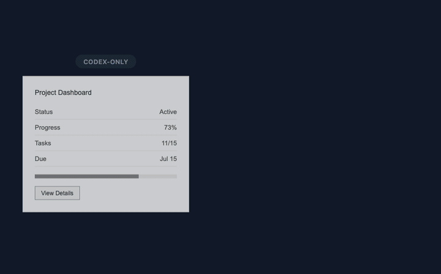

<sub>🌐 <b>中文</b> · <a href="README.en.md">English</a></sub>

<div align="center">

# 搭子.skill (Partner)

> 我的 Claude Code 和 Codex 天下第一好。

[](SKILL.md)
[](https://github.com/LearnPrompt/partner-skill/stargazers)
[](LICENSE)

**让 Claude Code 负责高价值判断，让 Codex 负责长上下文落地，并用一张 Session Receipt 证明没有乱开新 Claude 会话烧预算。**

[30 秒装上](#30-秒装上) · [一句话用起来](#一句话用起来) · [主-Showcase](#主-showcase) · [成本压力模型](#成本压力模型) · [它解决什么](#它解决什么) · [安全边界](#安全边界) · [验证](#验证)

</div>

---

## 30 秒装上

让你的 Agent（Codex / Claude Code / Hermes 等）装上 Partner，最简单的是直接把 GitHub 链接发给它：

```text
请安装搭子.skill：https://github.com/LearnPrompt/partner-skill
```

或者用 `npx` 一行：

```bash
npx skills add LearnPrompt/partner-skill -g
```

本地开发或手动安装：

```bash
git clone https://github.com/LearnPrompt/partner-skill.git
cd partner-skill
bash install.sh --target codex
bash install.sh --target claude
```

## 一句话用起来

```text
搭子，用同一个 Claude Code 会话先规划；我让 Codex 实现后，
你再把 diff 交回同会话做 UI polish 和 /codex:review，
最后给我 Partner Session Receipt，看有没有新开 claude -p。
```

也可以更短：

```text
搭子，Claude 计划，Codex 实现，同会话 review，最后出 receipt。
```

## 主 Showcase



这个 showcase 故意把反差做大：

- **纯 Codex first pass**：功能对，但界面平、没有动效、没有传播感。
- **搭子触发**：用一句话把 Claude Code 和 Codex 的分工固定成协议。
- **Claude Code polish**：同一个 Claude 会话负责 UI 口味、动效方向、边界审查。
- **Partner Session Receipt**：最后证明 `new_claude_p_sessions: 0`，不把“省钱”说成玄学。

视觉方向参考 MotionSites 模板页里常见的 cinematic hero 机制：暗色舞台、斜置产品界面、紫粉发光和故事感；没有复制第三方素材。

## 成本压力模型

Partner 不是“多叫一个模型”，而是**让 Claude Code 不重复冷启动**。当前 README 使用的是 showcase workload model，不是 API billing telemetry；没有精确 token 日志时，不编造“省了多少 token”。

这张表由 `scripts/showcase-cost-ledger.py` 生成；源数据在 `examples/showcase-cost-ledger.json`。

| 没有 Partner | 有 Partner |
|---|---|
| Claude 规划一次，Codex 改完后又新开 Claude review | 同一个 Claude Code 会话保留计划上下文 |
| 每次 review 都重新解释 repo、目标、diff | Codex 只回传 bounded handoff |
| “省 token”说不清楚 | receipt 明确写 `new_claude_p_sessions: 0` |

三种模式的对比：

| 模式 | Codex 承担 | Claude Code 承担 | Claude 压力 | 适合场景 |
|---|---:|---:|---:|---|
| 纯 Codex | 100% 实现与检查 | 0% | 0.0x，但缺少 Claude 的 UI / review 视角 | 低风险、无 UI 口味要求 |
| 搭子 Partner | 约 70% 实现、检查、修复 | 约 30% 计划、polish、review | 0.3x，且避免重复 cold start | UI-heavy、功能多、需要省 Claude API 成本 |
| 纯 Claude Code | 0% | 100% 全流程 | 1.0x，机械改动也由 Claude 承担 | 很短任务或用户明确要 Claude 全包 |

标准收尾小票：

```text
[Partner session receipt]
phase: final fix
claude_session: 9836fe7e-4aca-47a6-83b5-69086b8db275
claude_session_reused: yes
new_claude_p_sessions: 0
codex_passes: 2
checks: bash scripts/check-skill-repo.sh .; jq schema check; git diff --check
anomalies: none
```

没有可靠 telemetry 时，不编造“省了多少 token”。Partner 只报告可验证事实：有没有复用同一个 Claude 会话，有没有新开 `claude -p`，检查是否通过。

## 它解决什么

你已经在 Codex 和 Claude Code 之间来回切了。问题不是“能不能协作”，而是协作经常变成这样：

- Claude Code 适合计划、UI 口味、review，但让它做所有机械改动很贵；
- Codex 适合长上下文实现、跑检查、修细节，但 UI polish 和最终审查需要另一个视角；
- 最浪费的是 Codex 实现后又新开一个 Claude，会话上下文全丢，Claude 重新读项目；
- 用户只听到“我用了 Claude”，看不到到底有没有省钱。

Partner 把这件事变成固定协议：

```text
Claude Code same session:
  plan -> polish -> /codex:review

Codex:
  implement -> verify -> monitor -> fix -> receipt
```

## 触发方式

```text
搭子
搭子，帮我规划一下这个任务。
用 Claude Code goal 先规划，你 Codex 来实现。
同一个 Claude Code 对话里先出 plan，你实现后再让它 polish 和 /codex:review。
让 Claude skip 做完这个 UI 交互优化，你监控它。
Claude 里跑 Codex Review 验收当前 diff，发现问题你来修。
```

## 它会交付什么

- 一条清晰分工：Claude Code 负责计划、polish、review；Codex 负责实现、监控、验证、修复。
- 一个省预算默认策略：小中型任务尽量复用同一个 Claude Code 会话。
- 一个 bounded handoff 模板：只把 Claude 需要的计划、diff stat、检查结果、风险交回去。
- 一个监控清单：PTY、`claude agents --json`、transcript、task files、git diff/test 五层证据。
- 一个 Session Receipt：把是否复用会话、是否新开 `claude -p`、检查和异常写清楚。
- 一个 Darwin-style 验证门：一次只改一个协作维度，过检查才保留。

## 文件结构

```text
SKILL.md                         Runtime instructions for Codex/Claude-compatible agents
README.md                        中文入口
README.en.md                     English entrypoint
install.sh                       Local installer for Codex, Claude Code, Agents, or all targets
test-prompts.json                Trigger and behavior regression prompts
assets/showcase.gif              Session budget / receipt showcase
docs/current-progress.md         当前公开化进度、已验证检查与下一步
docs/claude-code-refinement-brief.md
                                  Claude Code 精细化调整交接包
docs/showcase-cost-model.md      Showcase 成本压力模型与真实 token 记录字段
docs/release-readiness-report.md 发布就绪度检查记录
examples/session-receipt.md      Minimal visible proof of same-session reuse
examples/showcase-cost-ledger.json
                                  三种模式的成本压力 ledger
examples/skill-inventory-miniloop.md
                                  保留的安全 skill 小闭环示例
references/monitoring.md         How Codex monitors Claude Code progress
references/handoff-template.md   Bounded context packet for Claude Code polish/review
references/darwin-ratchet.md     Validation-gated improvement rules
scripts/generate-showcase-gif.py Rebuilds the README showcase asset
scripts/showcase-cost-ledger.py  Rebuilds the showcase cost-pressure ledger
scripts/check-readme-parity.py   检查中英文 README 章节和关键证据是否对齐
scripts/check-skill-repo.sh      Publish readiness smoke check
```

## 安全边界

- `/goal` 只能在交互式 Claude Code 会话里用；不要用 `claude -p "/goal ..."`。
- `skip` / `bypassPermissions` 只在用户明确要求或隔离 worktree 里使用。
- skip 模式不等于允许 commit、push、deploy、publish、发外部消息或碰 secrets。
- 不默认新开 `claude -p` 做 final review；优先恢复同一个 Claude Code 会话。
- 不改 repo visibility、不打 tag、不发 registry、不公告，除非用户单独明确授权。
- 不用 `git reset --hard` 当默认回刀方案；优先用可审计 diff 或 revert。

## 验证

```bash
bash scripts/check-skill-repo.sh .
python3 scripts/check-readme-parity.py
jq -r '.[].id' test-prompts.json
python3 scripts/generate-showcase-gif.py
SOURCE_DATE_EPOCH=1782921600 python3 scripts/showcase-cost-ledger.py
```

合格表现：

- `SKILL.md` 里有裸词 `搭子` 触发；
- `README.md` 和 `README.en.md` 的 11 个章节顺序完全对齐；
- README 能在 10 秒内讲清“少开 Claude 冷启动会话”；
- `assets/showcase.gif` 能看懂预算差异；
- `examples/showcase-cost-ledger.json` 能复现三种模式的成本压力表；
- `Partner Session Receipt` 在 `SKILL.md`、README 和测试 prompt 里都有；
- 本地检查 `fail=0`，只允许安全文档里的高风险命令 warning。

## License

MIT
